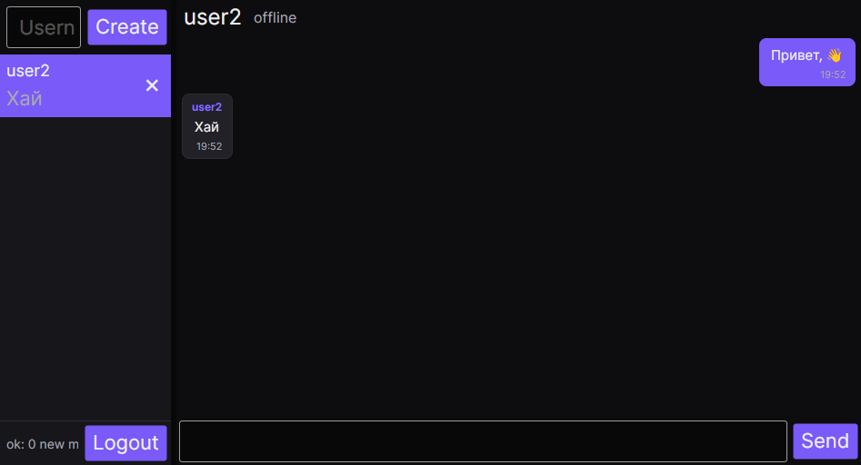
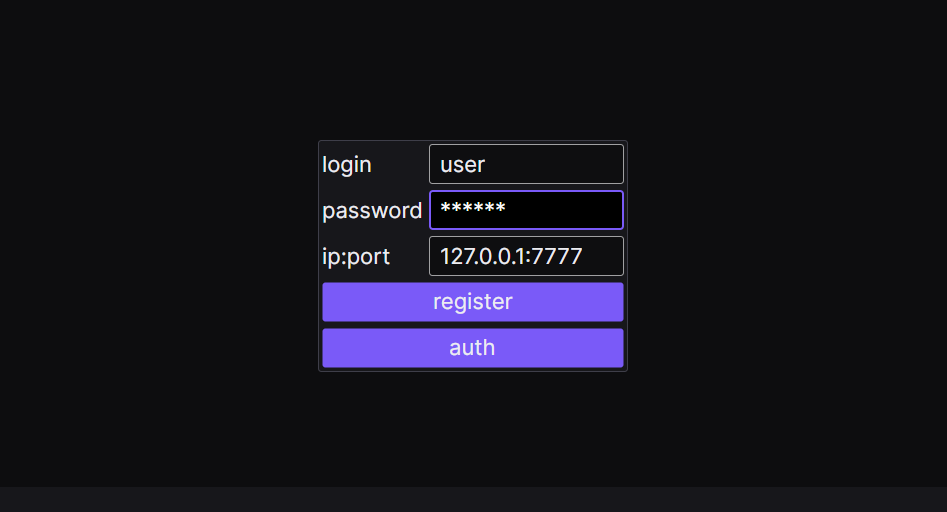

<div align="center">


# Avalox Client

[](https://dotnet.microsoft.com/)
[](https://dotnet.microsoft.com/download/dotnet/10.0)
[](https://avaloniaui.net/)
[](https://learn.microsoft.com/dotnet/communitytoolkit/mvvm/)
[](LICENSE)

**Cross-platform desktop TCP messaging client built with C#, Avalonia UI, and .NET 10.**

🌐 **English** • [Русский](README.ru.md)

[Screenshots](#-screenshots) • [Features](#-features) • [Tech Stack](#-tech-stack) • [Architecture](#-architecture) • [Network Protocol](#-network-protocol) • [Getting Started](#-getting-started) • [License](#-license)

</div>

---

## 📸 Screenshots

<div align="center">

### Main Chat Interface


<br/><br/>

### Authentication & Server Connection


</div>

---

## ✨ Features

- 🎨 **Interface**: Dark theme with purple accents (`#7A5AF8`) and the *Inter* font.
- 💬 **Conversations & Messaging**:
  - Sidebar with active chat previews and last received messages.
  - Quick chat creation by username.
  - Chat removal with local history cleanup.
  - Message bubble styling with distinction between sent (accent, right-aligned) and received (left-aligned) messages, accompanied by timestamps.
- 🟢 **Live Online Presence**: Real-time status indicators tracking whether a conversation partner is `online`, `offline`, or disconnected.
- 🛡️ **Networking**:
  - Asynchronous TCP client using sockets.
  - Outgoing requests are queued via `Channels` so packets don't overlap.
  - Status bar notifications if connection drops.
- 🔐 **Authentication & Registration**: Connect to any server address (`ip:port`).
- 🚪 **Logout**: Closes the connection and returns to the login screen.

---

## 🛠 Tech Stack

- **Platform**: [.NET 10.0](https://dotnet.microsoft.com/) (C# 13)
- **UI Framework**: [Avalonia UI 12.1](https://avaloniaui.net/) (Linux, Windows, macOS)
- **Architecture**: MVVM (Model-View-ViewModel)
- **MVVM Toolkit**: `CommunityToolkit.Mvvm 8.4` (Source Generators, `ObservableProperty`, `RelayCommand`)
- **Networking**: `System.Net.Sockets.TcpClient`, `System.Threading.Channels`, `System.Text.Json`

---

## 🏛 Architecture

```
Avalox/
├── Assets/                 # Application icon (PNG / multi-resolution ICO)
├── Previews/               # Interface screenshots
├── Models/                 # DTOs and network models
│   ├── ChatPreview.cs      # Sidebar chat preview model
│   ├── Connection.cs       # Channel-based async TCP client
│   ├── Credentials.cs      # Login / registration credentials
│   ├── LastMessageInfo.cs  # Message synchronization request
│   ├── Message.cs          # Chat message DTO
│   ├── Request.cs          # Internal request packet wrapper
│   ├── Response.cs         # Unified server response DTO
│   └── TargetUser.cs       # Online status query DTO
├── ViewModels/             # Presentation logic
│   ├── ChatViewModel.cs    # Active chat & background polling logic
│   ├── MainViewModel.cs    # View navigation manager
│   ├── RegAuthViewModel.cs # Authentication & registration logic
│   └── ViewModelBase.cs    # Base ObservableObject wrapper
├── Views/                  # XAML views and code-behind
│   ├── ChatView.axaml      # Main messenger and sidebar UI
│   ├── MainWindow.axaml    # Window container with custom icon
│   └── RegAuthView.axaml   # Authentication screen
├── App.axaml               # Global theme, brushes, and control styles
├── Program.cs              # Avalonia application entry point
└── ViewLocator.cs          # Automatic ViewModel-to-View resolver
```

---

## 📡 Network Protocol

The client communicates with [AvaloxServer](https://github.com/wellmq/AvaloxServer) over a binary-framed TCP protocol:

$$\text{[ 1 byte: Type ]} + \text{[ 4 bytes: Int32 Payload Length ]} + \text{[ N bytes: JSON Payload ]}$$

### Packet Routing Table:
| Code | Direction | Purpose | Payload |
|:---:|:---:|:---|:---|
| `0` | Client ➔ Server | Registration | `Credentials` (login, password) |
| `1` | Client ➔ Server | Authentication | `Credentials` (login, password) |
| `2` | Client ➔ Server | Send Message | `Message` (receiver, text) |
| `3` | Client ➔ Server | Fetch New Messages | `LastMessageInfo` (ID of last known message) |
| `4` | Client ➔ Server | Query Online Status | `TargetUser` (target username) |

---

## 🚀 Getting Started

### Prerequisites
- [.NET 10.0 SDK](https://dotnet.microsoft.com/download/dotnet/10.0)

### Clone & Run
1. Clone the repository:
   ```bash
   git clone https://github.com/wellmq/Avalox.git
   cd Avalox
   ```

2. Build the project:
   ```bash
   dotnet build
   ```

3. Launch the application:
   ```bash
   dotnet run
   ```

### Connecting to Server
On the initial screen:
- Enter your **username** and **password**.
- Specify the server address in the `ip:port` field (e.g., `127.0.0.1:7777`).
- Click **register** to create an account, or **auth** to sign in.

---

## 🔗 Related Project

- **Server**: [AvaloxServer](https://github.com/wellmq/AvaloxServer) — Server component with SQLite storage and password hashing.

---

## 📄 License

This project is licensed under the [MIT License](LICENSE).
