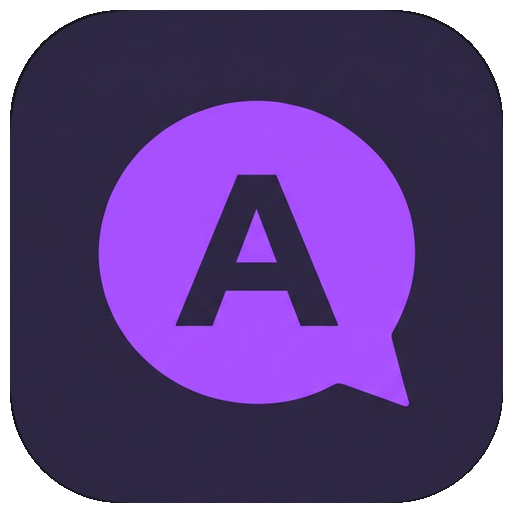

<div align="center">



# Avalox Client

[](https://dotnet.microsoft.com/)
[](https://dotnet.microsoft.com/download/dotnet/10.0)
[](https://avaloniaui.net/)
[](https://learn.microsoft.com/dotnet/communitytoolkit/mvvm/)
[](LICENSE)

**Кроссплатформенный настольный TCP-мессенджер на C#, Avalonia UI и .NET 10.**

🌐 [English](README.md) • **Русский**

[Возможности](#-основные-возможности) • [Стек технологий](#-стек-технологий) • [Архитектура](#-архитектура) • [Сетевой протокол](#-сетевой-протокол) • [Быстрый старт](#-быстрый-старт) • [Лицензия](#-лицензия)

</div>

---

## ✨ Основные возможности

- 🎨 **Интерфейс**: Тёмная тема с фиолетовыми акцентами (`#7A5AF8`) и шрифтом *Inter*.
- 💬 **Диалоги и чаты**:
  - Сайдбар со списком всех чатов и превью последних сообщений.
  - Поиск и создание новых диалогов по логину.
  - Удаление чатов с локальной очисткой переписки.
  - Разделение сообщений на «свои» (справа, акцентные) и «чужие» (слева) со штампами времени `HH:mm`.
- 🟢 **Онлайн-статусы**: Отображение активности собеседников в реальном времени (`online` / `offline` / `нет связи`).
- 🛡️ **Сетевое подключение**:
  - Асинхронный TCP-клиент на сокетах.
  - Исходящие запросы идут через очередь `Channels`, чтобы пакеты не перемешивались.
  - Уведомления в строке статуса при потере связи.
- 🔐 **Авторизация и регистрация**: Подключение к серверу по любому адресу (`ip:port`).
- 🚪 **Выход**: Закрытие соединения и возврат на экран входа.

---

## 🛠 Стек технологий

- **Платформа**: [.NET 10.0](https://dotnet.microsoft.com/) (C# 13)
- **GUI-фреймворк**: [Avalonia UI 12.1](https://avaloniaui.net/) (кроссплатформенный: Linux, Windows, macOS)
- **Архитектурный паттерн**: MVVM (Model-View-ViewModel)
- **MVVM Toolkit**: `CommunityToolkit.Mvvm 8.4` (Source Generators, `ObservableProperty`, `RelayCommand`)
- **Сетевой стек**: `System.Net.Sockets.TcpClient`, `System.Threading.Channels`, `System.Text.Json`

---

## 🏛 Архитектура проекта

```
Avalox/
├── Assets/                 # Иконка приложения (PNG / мультиразмерный ICO)
├── Models/                 # DTO и модели данных
│   ├── ChatPreview.cs      # Превью чата в сайдбаре
│   ├── Connection.cs       # Асинхронный TCP-клиент на каналах
│   ├── Credentials.cs      # Учётные данные (логин/пароль)
│   ├── LastMessageInfo.cs  # Запрос синхронизации сообщений
│   ├── Message.cs          # Сообщение чата
│   ├── Request.cs          # Сетевой пакет
│   ├── Response.cs         # Ответ от сервера
│   └── TargetUser.cs       # Запрос статуса пользователя
├── ViewModels/             # Презентационная логика
│   ├── ChatViewModel.cs    # Логика мессенджера и поллинга
│   ├── MainViewModel.cs    # Управление экранами приложения
│   ├── RegAuthViewModel.cs # Логика входа и регистрации
│   └── ViewModelBase.cs    # Базовый класс для ObservableObject
├── Views/                  # Разметка XAML и Code-Behind
│   ├── ChatView.axaml      # Основное окно чата и списка диалогов
│   ├── MainWindow.axaml    # Главное окно контейнера
│   └── RegAuthView.axaml   # Экран авторизации / регистрации
├── App.axaml               # Глобальные стили, темы и кисти
├── Program.cs              # Точка входа инициализации Avalonia
└── ViewLocator.cs          # Автоматическое сопоставление View и ViewModel
```

---

## 📡 Сетевой протокол

Клиент взаимодействует с сервером [AvaloxServer](https://github.com/wellmq/AvaloxServer) по бинарному протоколу поверх TCP с фреймингом:

$$\text{[ 1 байт: Type ]} + \text{[ 4 байта: Int32 Payload Length ]} + \text{[ N байт: JSON Payload ]}$$

### Таблица маршрутизации:
| Код | Направление | Назначение | Payload |
|:---:|:---:|:---|:---|
| `0` | Client ➔ Server | Регистрация | `Credentials` (логин, пароль) |
| `1` | Client ➔ Server | Авторизация | `Credentials` (логин, пароль) |
| `2` | Client ➔ Server | Отправка сообщения | `Message` (получатель, текст) |
| `3` | Client ➔ Server | Запрос новых сообщений | `LastMessageInfo` (ID последнего сообщения) |
| `4` | Client ➔ Server | Запрос онлайн-статуса | `TargetUser` (логин собеседника) |

---

## 🚀 Быстрый старт

### Требования
- [.NET 10.0 SDK](https://dotnet.microsoft.com/download/dotnet/10.0)

### Сборка и запуск
1. Клонируйте репозиторий:
   ```bash
   git clone https://github.com/wellmq/Avalox.git
   cd Avalox
   ```

2. Соберите проект:
   ```bash
   dotnet build
   ```

3. Запустите клиент:
   ```bash
   dotnet run
   ```

### Подключение к серверу
При запуске приложения на экране входа укажите:
- **Логин** и **пароль**
- **Адрес сервера** в поле `ip:port` (например, `127.0.0.1:7777`)
- Нажмите **register** для создания аккаунта или **auth** для входа.

---

## 🔗 Связанный проект

- **Сервер**: [AvaloxServer](https://github.com/wellmq/AvaloxServer) — TCP-сервер с базой данных SQLite и хешированием паролей.

---

## 📄 Лицензия

Проект распространяется под лицензией [MIT](LICENSE).
